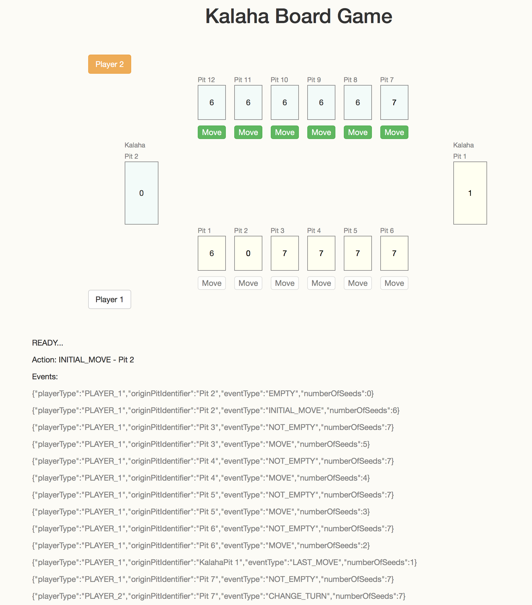

# Kalaha Board Game web using Play framework

This is a simple Kalaha Board game web UI that makes use of my event-driven [KalahaCoreLibrary](https://github.com/amhamid/KalahaCoreLibrary). 
This project makes use of Play framework 2.4.2 using Java and basically it starts a WebSocket where client can play Kalaha with 2 players (currently from the same computer).

This web UI is a simple UI that propagates all events emitted by Kalaha core library based on user actions.
This UI contains no logic on Kalaha game rules, only event handling and animations.

To run in you need TypeSafe Activator 1.3.5+, it will be run on default port 9000:
**Note:** For this version 1.1, you need to run it on port 9000 as currently I use that port to connect to the WebSocket connection.

```
activator run
```

For demo purposes, I uploaded a YouTube video of this application (no sound) [See demo](https://www.youtube.com/watch?v=chwWDDO3Aeo)

Here is also a screenshot, where I just start the first move from player 1 on pit number 2.
In the bottom of the page, you see the events being emitted by KalahaCoreLibrary that are handled by this UI.

